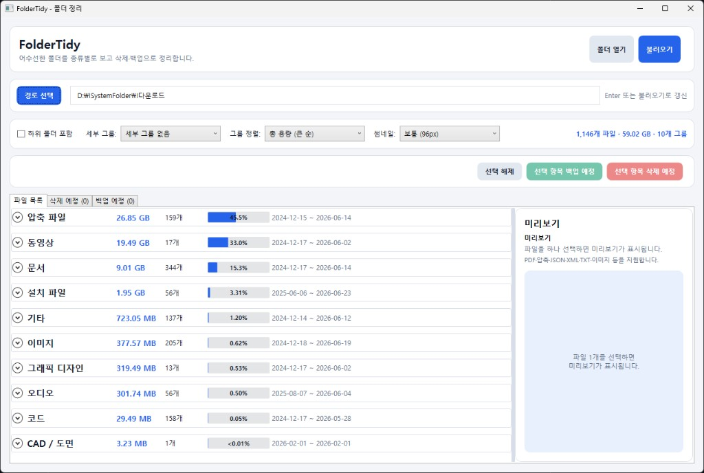
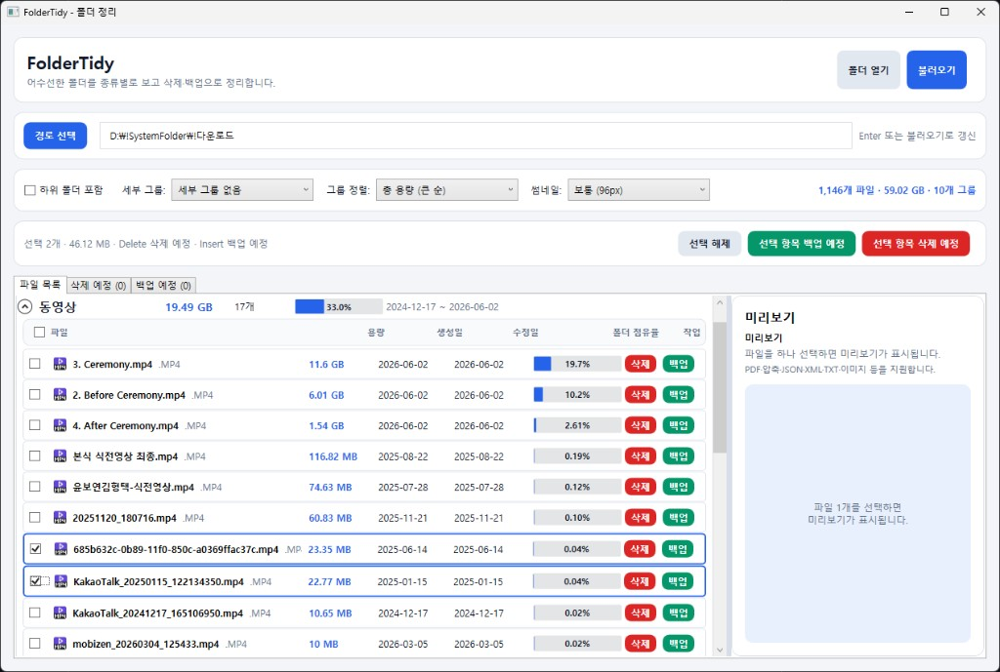
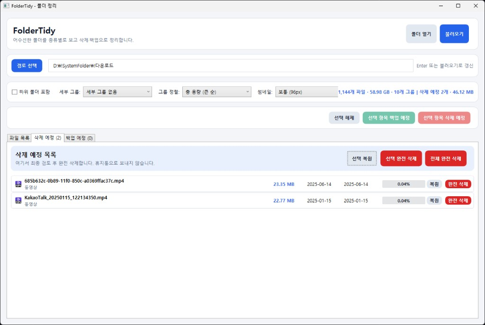
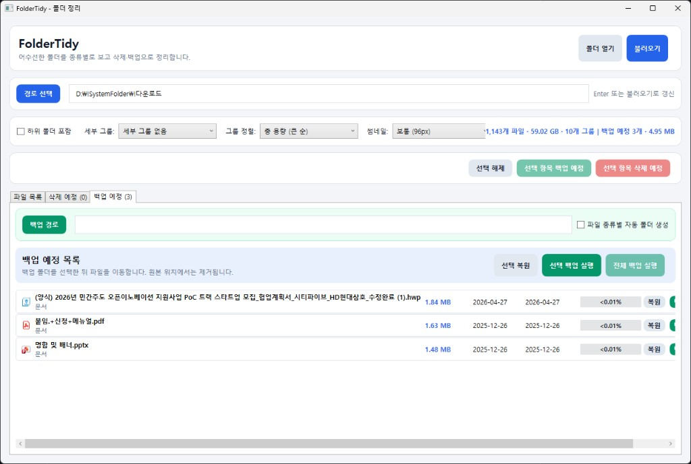

# FolderTidy

Windows용 폴더 정리 도구입니다. 다운로드 폴더처럼 파일이 한곳에 쌓인 디렉터리를 **종류별로 묶어 보고**, **삭제**와 **백업(이동)** 으로 정리하는 흐름에 맞춰 만들었습니다.

> **Platform:** Windows only (WPF)  
> **Runtime:** [.NET 10 SDK](https://dotnet.microsoft.com/download)

## 주요 기능

### 파일 목록
- 폴더 스캔 (하위 폴더 포함 옵션)
- 파일 종류별 그룹: 설치 파일, 압축, 이미지, 그래픽 디자인, CAD/도면, 문서, 동영상, 오디오, 코드, 기타
- 그룹 정렬: 총 용량, 파일 수, 최신 생성일
- 세부 그룹: 생성일/수정일(월별), 파일 크기
- **폴더 점유율** 막대: 각 그룹·파일이 전체 용량의 몇 %인지 표시
- 컴팩트 목록 + 파일 형식 아이콘 (이미지는 선택 시 썸네일)
- 파일명 **더블클릭**으로 실행
- 미리보기 패널: 이미지, PDF, 텍스트/JSON/XML, 압축 파일 트리

### 삭제 예정
- 목록에서 **삭제** → 삭제 예정 탭으로 이동 (목록에서 흐리게 표시)
- 탭에서 검토 후 **완전 삭제** (휴지통 경유 없음)
- 목록 탭에서도 **복원** 가능

### 백업 예정
- 목록에서 **백업** → 백업 예정 탭으로 이동
- 백업 폴더 경로 지정 (필수)
- **파일 종류별 자동 폴더 생성** 옵션 (예: `이미지`, `압축 파일` 하위 폴더)
- 실행 시 선택한 백업 폴더로 파일 **이동** (원본 위치에서 제거)

### 단축키 (파일 목록 탭)
| 키 | 동작 |
|----|------|
| `Insert` | 선택 항목 백업 예정 |
| `Delete` | 선택 항목 삭제 예정 |
| `Ctrl` / `Shift` | 다중 선택 |

## 스크린샷

### 메인 화면 — 종류별 그룹과 점유율



### 파일 목록 — 그룹 펼치기, 다중 선택, 백업·삭제 예정



### 삭제 예정 탭



### 백업 예정 탭



## 빌드 및 실행

```powershell
git clone https://github.com/kinadog/FolderTidy.git
cd FolderTidy
dotnet run --project FolderTidy/FolderTidy.csproj
```

Release 빌드:

```powershell
dotnet publish FolderTidy/FolderTidy.csproj -c Release -r win-x64 --self-contained false
```

## 프로젝트 구조

```
FolderTidy/
├── FolderTidy.slnx
├── README.md
└── FolderTidy/
    ├── FolderTidy.csproj
    ├── MainWindow.xaml          # UI
    ├── ViewModels/              # MVVM
    ├── Services/                # 스캔, 미리보기, 삭제, 백업
    ├── Models/
    ├── Helpers/
    └── Converters/
```

## 기술 스택

- **.NET 10** + **WPF**
- [Docnet.Core](https://www.nuget.org/packages/Docnet.Core) — PDF 미리보기
- [SharpCompress](https://www.nuget.org/packages/SharpCompress) — 압축 파일 트리

## 주의사항

- **완전 삭제**는 복구할 수 없습니다. 삭제 예정 탭에서 최종 확인 후 실행하세요.
- **백업 실행**은 파일을 **이동**합니다. 원본 경로의 파일은 사라집니다.
- 그래픽 디자인 파일(`.psd`, `.ai` 등) 미리보기는 Windows/Adobe 썸네일 제공 여부에 따라 달라집니다.

## 기여

Issue와 Pull Request를 환영합니다. 큰 변경은 먼저 Issue로 논의해 주세요.

## 라이선스

라이선스는 추후 추가 예정입니다. (공개 시 MIT 등을 검토해 주세요.)

## 작성자

[kinadog](https://github.com/kinadog)
